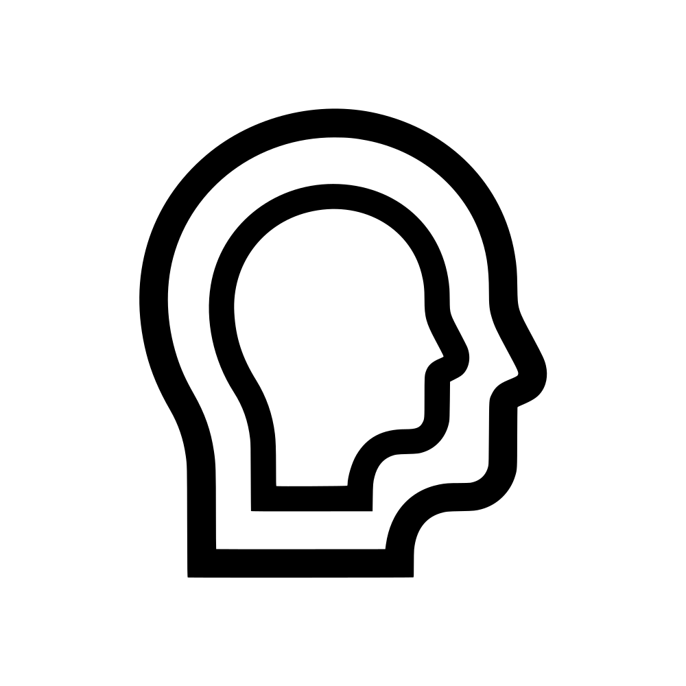
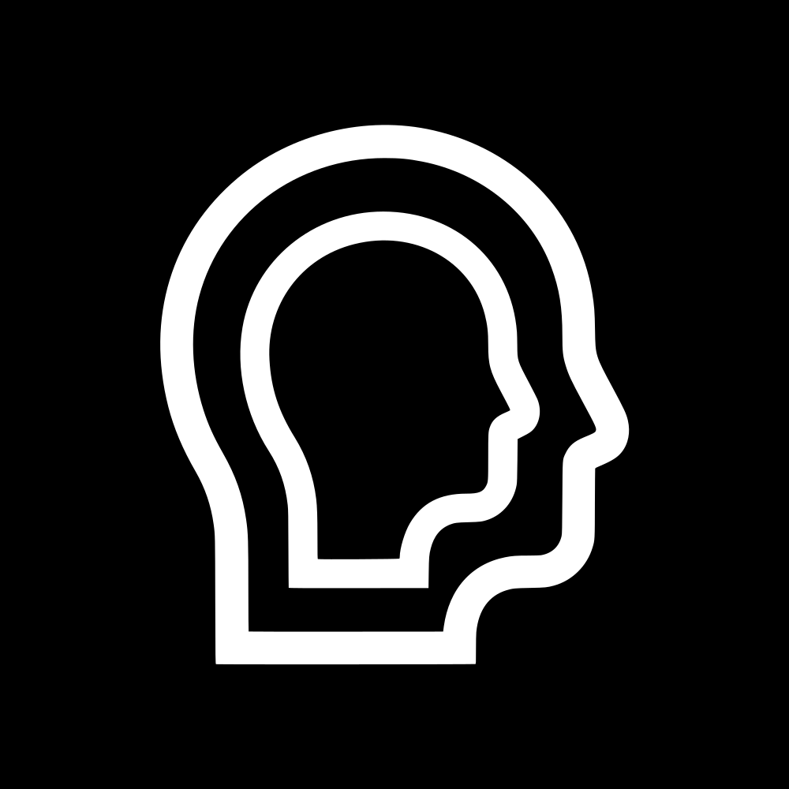
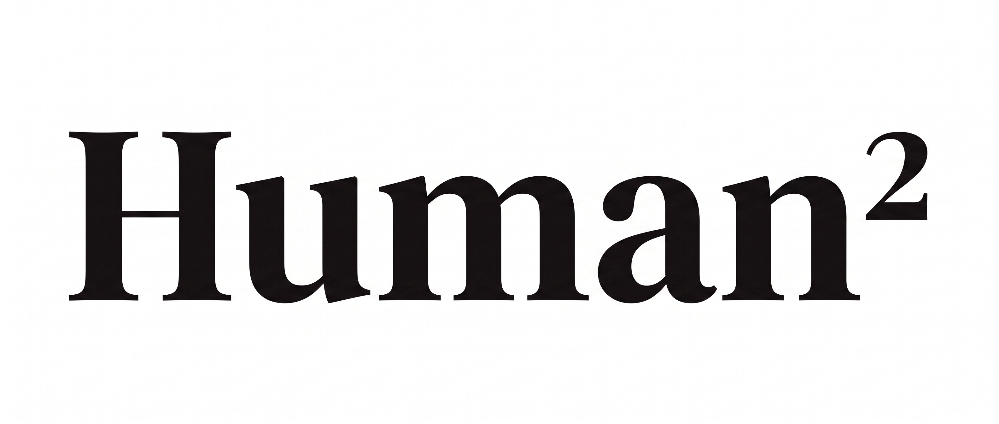

# Human² — brand assets

Official logo and wordmark of **Human²** ("Human Squared"). Humans, amplified by machines.

<p align="center">
  
  
</p>
<p align="center">
  
</p>

## The mark

One human profile expands into a larger version of itself: the same identity, with greater presence and capability. The wordmark reads **Human²**, with the exponent standing for that amplification.

## Files

### Logo

| File | Colours | Use |
| --- | --- | --- |
| [`logo/human2-logo-black-on-white.svg`](logo/human2-logo-black-on-white.svg) | Black on white | Vector, square placements |
| [`logo/human2-logo-white-on-black.svg`](logo/human2-logo-white-on-black.svg) | White on black | Vector, square placements |
| [`logo/human2-logo-black-on-white-padded.svg`](logo/human2-logo-black-on-white-padded.svg) | Black on white | Vector, round avatars and app icons |
| [`logo/human2-logo-white-on-black-padded.svg`](logo/human2-logo-white-on-black-padded.svg) | White on black | Vector, round avatars and app icons |
| `logo/human2-logo-*.jpg` | Same four variants | Raster, 2048 × 2048 |

The padded versions keep the mark inside 82 % of the inscribed circle, so nothing touches the edge when a platform crops the image to a circle. Use them wherever the placement is round.

Every SVG has a background rectangle as its first element. Remove that line for a transparent background.

### Wordmark

| File | Size | Colours |
| --- | --- | --- |
| [`wordmark/human2-wordmark-21x9-3168x1344.jpg`](wordmark/human2-wordmark-21x9-3168x1344.jpg) | 3168 × 1344, 21:9 | Black on white |
| [`wordmark/human2-wordmark-1x1-3168x3168.png`](wordmark/human2-wordmark-1x1-3168x3168.png) | 3168 × 3168, 1:1 | Black on white |
| [`wordmark/human2-wordmark-21x9-3168x1344-inverted.jpg`](wordmark/human2-wordmark-21x9-3168x1344-inverted.jpg) | 3168 × 1344, 21:9 | White on black |
| [`wordmark/human2-wordmark-1x1-3168x3168-inverted.png`](wordmark/human2-wordmark-1x1-3168x3168-inverted.png) | 3168 × 3168, 1:1 | White on black |

### Hero image

The New Adam with the Human² wordmark and the line "Merging Humans and Machines", 2812 × 1674. All text stays in a tight band around the hands, so wide banner and cover crops keep everything.

Two layouts:

- **Centred**: the fingertip touch and the text sit at the exact horizontal centre.
- **Offset**: touch and text sit at 61 % of the width, with the painting zoomed in 1.22× from its left edge. Use it for profile banners where an avatar or logo overlaps the lower left corner and would cover the start of the headline.

| Treatment | Centred | Offset |
| --- | --- | --- |
| Bright | [`human2-hero-bright.jpg`](hero/human2-hero-bright.jpg) | [`human2-hero-offset-bright.jpg`](hero/human2-hero-offset-bright.jpg) |
| Bright, vignette | [`human2-hero-bright-vignette.jpg`](hero/human2-hero-bright-vignette.jpg) | [`human2-hero-offset-bright-vignette.jpg`](hero/human2-hero-offset-bright-vignette.jpg) |
| Slightly darkened | [`human2-hero-dark.jpg`](hero/human2-hero-dark.jpg) | [`human2-hero-offset-dark.jpg`](hero/human2-hero-offset-dark.jpg) |
| Slightly darkened, vignette | [`human2-hero-dark-vignette.jpg`](hero/human2-hero-dark-vignette.jpg) | [`human2-hero-offset-dark-vignette.jpg`](hero/human2-hero-offset-dark-vignette.jpg) |

Regenerate all eight with `python3 scripts/make-hero.py` (needs Pillow, and macOS for SF Pro). The script reads `hero/source/the-new-adam-5504x3072.jpg`, a full-resolution JPEG of the painting, and takes the wordmark straight from `wordmark/`, so the image always matches the official artwork. The painting's masters and history live in the `the-new-adam` repo.

## Usage

- Use the black-on-white version on light backgrounds and the white-on-black version on dark backgrounds.
- Keep the mark in its original proportions. Do not stretch, rotate, outline, add effects or change its colours.
- Leave clear space around the mark of at least the width of the outer profile's stroke.
- Do not redraw the mark or combine it with other symbols.
- Use the padded files for round crops; use the unpadded files when the container is square or rectangular.

## Linking to the assets

Both link styles work for public pages, including SVG. jsDelivr adds CDN caching, which suits high-traffic pages.

```
https://raw.githubusercontent.com/humansquared/brand/main/logo/human2-logo-black-on-white-padded.svg
https://cdn.jsdelivr.net/gh/humansquared/brand@main/logo/human2-logo-black-on-white-padded.svg
```

```html

```

## Rights

Human² is a brand of Waveful Inc.

HUMAN SQUARED™ and the Human² logo are trademarks of Waveful Inc. and its subsidiaries; an EU trademark application is pending. © 2026 Waveful Inc.

You may use these files, unmodified, to refer to Human², for example in articles, partner pages and integrations. You may not use them to suggest endorsement or affiliation without permission, or as part of another product's identity.
